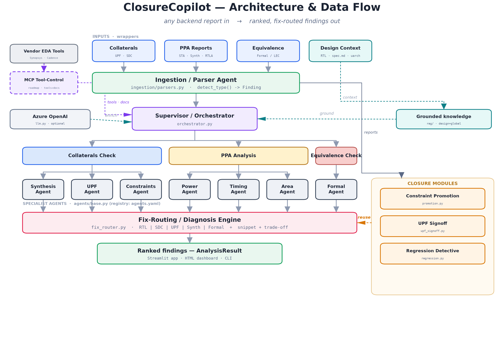
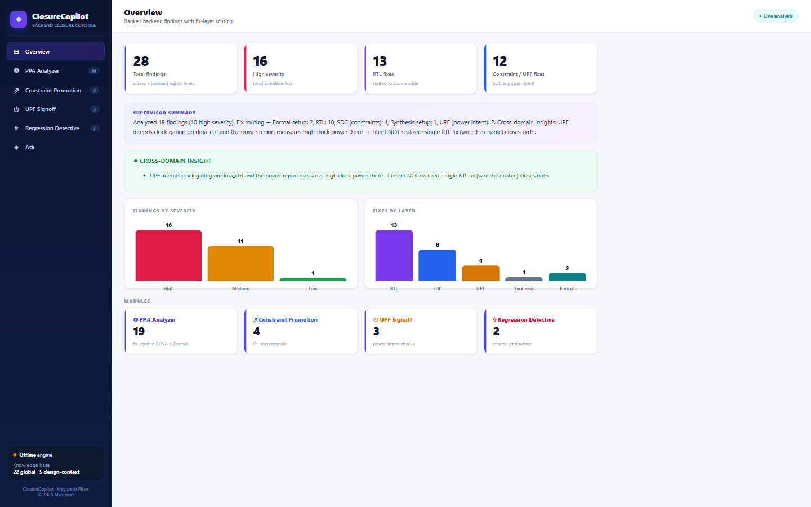

# ClosureCopilot

**An AI-Native, Multi-Agent Assistant for RTL PPA Closure**

> Feed it any backend report — RTLA power, synthesis, STA timing, area, UPF, SDC, or
> formal/LEC — and a crew of AI agents analyzes **Power, Performance, and Area together**,
> then tells the RTL engineer **exactly where to fix each issue: RTL, constraints (SDC),
> UPF, or the formal setup** — with corrected, copy-paste-ready snippets. Including IP→top
> constraint promotion.

---

## Why it matters
Power, performance and area (PPA) closure is the #1 grind in silicon design. RTL
engineers wait hours/days for backend runs, then struggle to read reports and trace
issues back to RTL. **No tool reasons across all three PPA domains at RTL stage, or
decides whether a fix belongs in RTL, constraints, or UPF.** ClosureCopilot does.

## What makes it unique
1. **Cross-domain PPA trade-off reasoning** — fixing timing may cost power/area; it ranks by net PPA.
2. **Fix-routing** — RTL vs SDC vs UPF vs synth-setup (the senior-engineer judgment).
3. **Corrected snippets** — ready-to-apply SDC / UPF / RTL fixes.
4. **Constraint promotion** — IP → subsystem → top.
5. **Dual-RAG** — global PPA knowledge + a persistent *Design Context Memory* (specs,
   micro-arch, past reports) so feedback is grounded in *your* design and improves over time.

## Product modules
A unified suite of backend-closure agents surfaced as one dashboard:

| Module | What it does |
|--------|--------------|
| **PPA Analyzer** | Ranked findings + fix-routing across power / timing / area / synthesis |
| **Constraint Promotion** | Reconciles IP/block SDC against top; flags clock/budget/exception mismatches; emits corrected top constraints |
| **UPF Signoff** | Power-intent counterpart to an SDC checker — isolation / retention / clock-gating checks with corrected UPF |
| **Regression Detective** | Diffs two backend runs and attributes each PPA regression to the commit that caused it ("git-blame for PPA") |

The **Equivalence Check** group adds a **Formal (LEC) Agent** that routes each non-equivalence
to a *formal-setup* fix (intended clock-gating/retiming ECO) vs a *genuine RTL bug*.


## Architecture



```
Inputs (wrappers)   Collaterals (UPF·SDC) · PPA Reports (STA·Synth·RTLA) ·
                    Equivalence (Formal/LEC) · Design Context (RTL·spec·µarch)
        │                                               │
        ▼                                               ▼
Ingestion / Parser Agent  ──►  Supervisor / Orchestrator  ◄── Grounded knowledge (RAG)
                                        │                 ◄── Azure OpenAI (LLM, optional)
      grouping layer:   Collaterals Check │ PPA Analysis │ Equivalence Check
      leaf agents:      Synthesis·UPF·Constraints │ Power·Timing·Area │ Formal
                                        │
                                        ▼
                       Fix-Routing / Diagnosis Engine   (RTL | SDC | UPF | Synth | Formal)
                                        │
                                        ▼
                       Ranked findings — Streamlit · HTML dashboard · CLI

Closure modules (reuse the Fix-Router):  Constraint Promotion · UPF Signoff · Regression Detective
Roadmap:  Vendor EDA Tools ──► MCP Tool-Control ──► Supervisor  (run tools · fetch reports & docs)
```

The specialist agents are declared in **[`agents.yaml`](agents.yaml)** — the Supervisor builds
them from that registry at runtime, so adding or re-tuning an agent is a config change, not code.
The `.drawio` source is in [`docs/architecture.drawio`](docs/architecture.drawio) (PNG/SVG exported
via `docs/gen_diagram.py`).

## Tech stack
Python 3.12 · Streamlit UI · ChromaDB (dual RAG) · Azure OpenAI (with a deterministic
**offline mode** so the demo runs even without credentials).

## Results dashboard (zero-install)

For a fast, dependency-free view of the analysis, open **[`docs/dashboard.html`](docs/dashboard.html)**
directly in any browser — a self-contained page (data embedded, works offline, no server).



It has six tabs — **Overview · PPA Analyzer · Constraint Promotion · UPF Signoff ·
Regression Detective · Ask** — with KPI cards, a supervisor summary,
cross-domain insights, severity/fix-layer charts, and ranked finding cards (each with the
fix-layer badge, corrected snippet, PPA trade-off, and grounding references). The **Ask**
tab answers plain-English questions over the findings, fully offline.

Regenerate it from the live pipeline anytime:
```powershell
python docs/export_results.py   # runs the analysis -> docs/results.json
python docs/build_dashboard.py  # renders docs/dashboard.html
```

## Quick start
```powershell
# from the ClosureCopilot folder
python -m venv .venv
.\.venv\Scripts\Activate.ps1
pip install -r requirements.txt

# copy env template and (optionally) add Azure OpenAI creds
Copy-Item .env.example .env

# run the app
streamlit run src/closurecopilot/ui/app.py
```
Without Azure credentials the app runs in **offline mode** with deterministic analysis
over the bundled sample reports in `data/samples/`.

## Status
Prototype under active development. See the project plan for phases.
